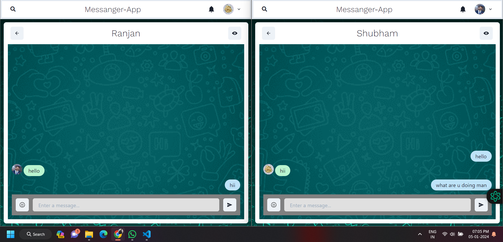

# Messenger App - Full Stack Chat Application

Welcome to the Messenger App, a real-time chat application built using the MERN (MongoDB, Express.js, React.js, Node.js) stack with Socket.io for real-time messaging and Lottie for checking typing functionality.


## Tech Stack

- **Frontend:**
  - React.js for the user interface.
  - Socket.io-client for real-time communication.
  - Lottie for checking typing functionality.

- **Backend:**
  - Node.js with Express.js for server-side logic.
  - Socket.io for real-time communication.
  - MongoDB for database storage.

## Setup Instructions

1. **Clone the Repository:**
   ```bash
   git clone https://github.com/ranjangupta4590/Messanger-APP/.git
   ```

2. # Go to the project directory
   cd messenger-app

3. **Install Dependencies:**
   ```bash
   # Install server dependencies
   npm install
   # Create a folder backend for the server side files
   
   # Install client dependencies
   cd ../frontend
   npm install
   ```

4. **Configure Environment Variables:**
   - Create a `.env` file in the `Messanger-APP` directory.
   - Add the following variables:
     ```
     MONGO_URI=your_mongo_db_uri
     PORT=your_server_port
     JWT_TOKEN=your_Token
     NODE_ENV=production/development
     ```

5. **Run the Application:**
   - Start the server:
     ```bash
     cd backend
     npm start or npm run server
     ```
   - Start the client/frontend:
     ```bash
     cd frontend
     npm start
     ```
   - Open your browser and visit `http://localhost:3000` to access the Messenger App.
  
## Features

- **User Authentication:**
  - Securely store and manage user credentials using MongoDB for data integrity and privacy compliance.
   
    
    
- **Real-Time Messaging:**
  - Engage in one-on-one or group chats with real-time messaging functionality.
  - 
    
- **Additional Features**
  -Group Chat Feature
   
  -Profile View
   
- **Emoticons Support:**
  - Express yourself with emoticons in your messages to make conversations more engaging.
  
- **Typing Indicator:**
  - Utilize Lottie for a visually appealing typing indicator, notifying users when someone is typing.

## Usage

- Create an account or log in.
- Start a new chat or join an existing one.
- Enjoy real-time messaging with typing indicators and emoticon support.
## Made By--
- [@ranjangupta4590]()

